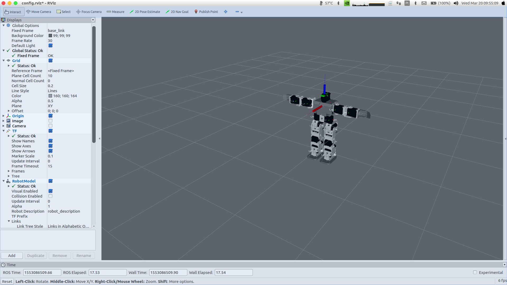

## bioloid_description

ROS package (mesh files and URDF) for Bioloid premium kit type A robot.
This package can be used with the real robot or Gazebo (physics simulator).

## ROS Dependecies
Install message-to-tf to convert odometry to tf:
```
$ sudo apt install ros-kinetic-message-to-tf 
```


## Usage
```
$ roslaunch bioloid_description rviz.launch
```




Adapted from https://github.com/MathieuR/bioloid_typea_description

