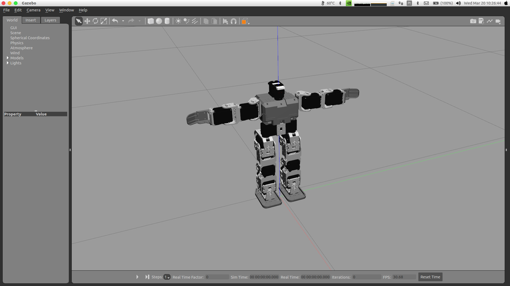

## bioloid_gazebo

ROS package providing Gazebo simulation of the Bioloid robot.

## Usage

You can launch the simulation with:

```
$ roslaunch bioloid_gazebo gazebo.launch
```

PRESS PLAY IN GAZEBO ONLY WHEN EVERYTHING IS LOADED (wait for controllers)



If you want to launch gazebo headless (without GUI) uses:
```
$ roslaunch bioloid_gazebo gazebo.launch uses_gui:=false
```

In order to move the joints using trajectory controller uses:
```
rosrun rqt_joint_trajectory_controller rqt_joint_trajectory_controller
```

To start the simulation call this service:
```
$ rosservice call /gazebo/unpause_physics "{}" 
```

## Dependencies

The following ROS packages have to be installed:
* gazebo_ros_control
